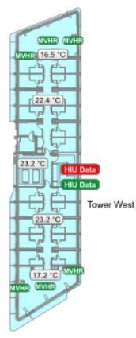
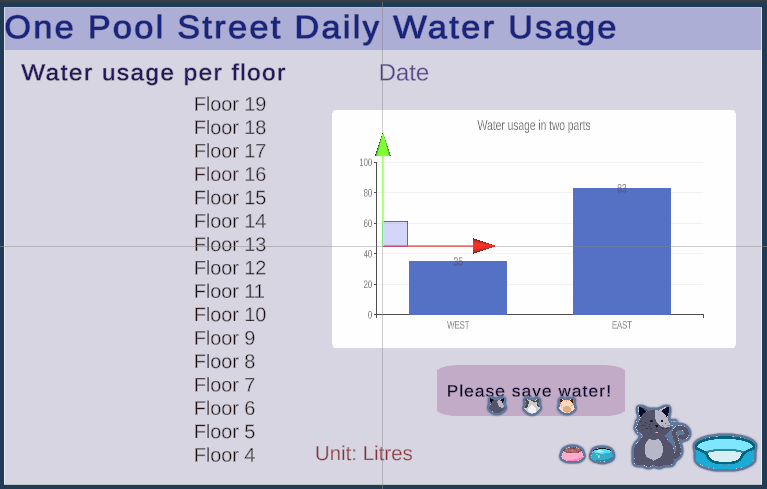

# CasaMigos

website: https://casa0019-group5.github.io/


---

## Why did we choose water data?

After receiving the initial assignment brief, we started digging through data sources linked with UCL. The source that caught our eye early on was the MQTT stream for One Pool Street (OPS), specifically, the water meter data from the building. Working with William Markiewicz, we came to understand the MQTT stream showed the total water usage from the time the sensors were first powered on, and that the data was only for floors 4 through 19 in the west tower. Furthermore, the MQTT topics were split by both floor and SAC. SAC is a term used to describe one half of a floor, in the below image, the floor is split through the middle, where the top half would be represented by SAC1, and the bottom half would be represented by SAC2. To anyone interested in looking at the existing datastream, the topic is: `UCL/OPSEBOAS/PSW TW20-XX-CE-001/BACnet Interface/Application/Energy Monitoring/Water Meters`.



_Tower West SACs_

---

## Initial Brainstorm

We then had to decide how we wanted to represent this data. After some brainstorming we were all in agreement that an old-fashioned water gauge was too bland, we wanted something more unique. Taking inspiration from one of Andy's projects where he had used a syringe visualize data, we took his model of the syringe and repurposed it to show the water usage data, through the syringe pushing water up the device to demonstrate the total daily water usage.

<video width="400" controls autoplay>
    <source src="./docs/physical_device_overview.MOV" type="video/mp4">
</video>

---

## Physical Device -- Jiaying Shen

### Main idea:

The Arduino queries a PiCloud API to retrieve water data, and the servo pushes the syringe. The total amount of water used by OPS for the day is displayed via a scale and NeoPixel lights.

### Design flow:

<div style="display: flex; align-items: center;">
  
</div>

<b> Stage 1: Syringe attachment method </b>
Thanks to Andy for supplying us with the following materials: 10ml syringes, 10ml cylinder, and plastic tubing, as well as the 3D models for the syringe holder, and rack and pinion gears. Some modifications have been made to address the device requirements.

When designing the physical device, I tried three different approaches. The first approach was to use a U-shaped tube with a hole at the bottom connected to a syringe. By pushing or pulling the syringe with a servo, water was injected or extracted to display the water level. However, due to the equal pressure, the water level on both sides of the U-tube remained the same, making it impossible to accurately reflect the movement of the syringe. 

The second approach used a soft tube to connect the syringe to a measuring cylinder. By pushing the syringe, water was injected into the cylinder to indicate water usage, and by pulling back water was withdrawn. However, during testing, I found some water remained in the cylinder building up after each reset, causing inaccurate readings and water loss. 

The final method successfully implemented was to connect two syringes with a plastic tube to form a sealed hydraulic system. Squeezing one syringe forced water into the other, moving the plunger to indicate water consumption. This solution prevented water build-up, allowed full water recirculation and ensured accurate resets, providing a stable and accurate measurement system.

<b> stage2: Servo selection and syringe connection </b>
As the syringe is filled with water, the servo needs sufficient torque to push the plunger. Precise control of the scale is required, so the servo must have a minimum rotation angle of 180 degrees.

#### Servo Comparison Table

| Servo Model | Torque (kg·cm) | Rotation Angle (degrees) | Voltage (Volt) |
| ----------- | -------------- | ------------------------ | -------------- |
| SG90        | 1.6            | 360                      | 4.8-6.0        |
| MG90S       | 1.8            | 180                      | 4.8-6.0        |
| TS90        | 1.8            | 180                      | 3.3-5.0        |
| Geek Servo  | 2              | 270                      | 3.0-5.0        |

After testing, some servos were unable to rotate a full 180 degrees, preventing the syringe from fully extending or resetting to zero. Servos with 180-degree rotation offer better precision and control compared to 360-degree servos. As a result, the Geek servo was ultimately chosen.

<b> Stage 3 : Circuit connection </b>

<div style="display: flex; align-items: center;">
  
</div>

<div style="display: flex; align-items: center;">
  
</div>

The Arduino controls the syringe and NeoPixel light to indicate water usage. First, the system connects to WiFi and initializes. Then, data is fetched from the Raspberry Pi and processed to map it to the position of the syringe servo and the state of the NeoPixel light. If the data is less than 500, the system resets the syringe piston to its initial position, otherwise it continues to cycle through data acquisition and processing to maintain a real-time response state.

<b> Stage 4 : Enclosure and test </b>  
A laser cutter was used to make holes in a single wooden board to hold both the syringe and the servo. The sizes and positions of the holes were determined through multiple tests to ensure that the servo could smoothly push and pull the syringe along the scale, reaching both maximum and minimum values. As the servo and NeoPixel are powered by Arduino, the entire circuit was placed in a box under the wooden board to maintain a clean appearance and avoid interference with the power supply. The box is secured with interlocking edges for stability and is easy to open and close. This allows for quicker access to the MKR1010's reset button, making troubleshooting and maintenance easier. 

https://github.com/user-attachments/assets/a4a8edd3-a0f4-40e1-bce6-6a52c5a1cce4.mp4

---

## MQTT to Raspberry Pi Database -- Vineeth Kirandumkara

One of the main problems encountered with the data stream was that the values we received was the total amount of water used since the time the sensors were powered on. This meant for example we couldn't display specific data such as data from the last 24 hours. To solve this, I created a javascript (`collect_water.js`) that ran every 10 minutes, to store the values from the MQTT stream in a SQL database along with a timestamp, the floor number and SAC. Using this database, I created an API (`server.js`) with 6 endpoints:

| Endpoint           | Description                     | Output                                                               |
| ------------------ | ------------------------------- | -------------------------------------------------------------------- |
| `/total/floor/:id` | Current Total Usage for a Floor | `{<LATEST TOTAL USAGE SAC1 + SAC2>}`                                 |
| `/total/SAC`       | Current Total Usage by SAC      | `{sac1: <LATEST TOTAL USAGE SAC1>, sac2: <LATEST TOTAL USAGE SAC2>}` |
| `/total/SAC/:id`   | Current Total Usage for an SAC  | `{<TOTAL USAGE FOR :id SAC>}`                                        |
| `/today/floor/:id` | Todays Usage for a Floor        | `{:id, <USAGE FOR :id OVER THE CURRENT DAY}`                         |
| `/today/SAC`       | The Difference in Today's Usage | `{<THE DIFFERENCE BETWEEN USAGE OF SAC1 AND SAC2}`                   |
| `/today/SAC/:id`   | Todays Usage by SAC             | `{:id, <TODAYS USAGE BY SAC>}`                                       |

### Backend Setup

The `collect_water.js` script is set up in a PM2 instance, this contains the entire build environment, and therefore allows us to set the environmental variables. This specific script is then restarted every 10 minutes using a crontab job. Furthermore, by using a PM2 instance, we can also provide the `server.js` file with all the private variables needed to be continuously running in the background of the pi.


### RaspberryPi Setup

#### Install

1. Pull the RpiScript folder onto the raspberry pi.
   It should include:

- `ecosystem.config.cjs` : Contains all the environmental variables to create and run the PM2 Instance. (create your own)
- `collect_water.js` : Script to update the database.
- `server.js` : Script that contains the API.

2. Run `npm init && npm install` to install all the required node packages listed in `package.json`.

3. Install mariadb-server using `apt install mariadb-server`

- Might have to reboot

4. Start up the mariaDB Server using `sudo systemctl start mariadb`

- Verify it's running with `sudo systemctl status mariadb`

- `CTRL-C` exits the status, without stopping the service.

5. Setup the password for mariaDB

- `sudo mariadb`
- `ALTER USER 'root'@'localhost' IDENTIFIED BY '<insert password here>`;
- `FLUSH PRIVILEGES;`
- `exit`

6. Check if you can login

- `mariadb -u root -p`
- enter selected password
- Note: password should match what is listed in the .env file

7. Run `collect_water.js`

- Note: Database is built on the first run, but is inaccessible by the script until the second run.

#### Check Results

1. Login to MariaDB

- `mariadb -u root -p`
- Enter Password
- `SELECT water_db;`
- `SELECT * FROM water_table;`

---

## Data and Scripts - Dashboard (EG)

### Initial Challenges

When we found the MQTT stream for the OPS Water Meter, I realised we could repurpose code from the workshop for our MQTT stream. Since we had access to 30 readings in total, I subscribed to each different floor using their unique topic. This as expected returned the value for each floor and worked completely fine. However, a problem arose when I tried to subscribe to more than 5 topics. I replicated the code below for multiple floors, however, when I tested it on the dashboard values were missing. After some debugging and consultation with Valerio, I figured out that Unity's speed of subscribing to the topics and returning its values was slower than the rate of new values that were received via MQTT. This resulted in the SAC values either being overwritten or simply not appearing.

```
public TextMeshProUGUI Floor15BAC2;  -Individual Text Mesh Pro For Each Floor

if (mqttObject.topic.Contains(""TW15-01-CE-001 BoostCWSMtrSAC2/Value""))' -Subscribing To Each Unique Topic
        {
            Floor15BAC2.text=mqttObject.msg;
```

Therefore, this approach was dropped and I refactored the code to use a dictionary. Using this approach I was able to subscribe to a topic and match them to their corresponding TextMeshPro, improving the rate of data retrieval from MQTT. In addition, adding a new floor was quicker as only the dictionary had to be updated. Overall, this removed the inefficient condition checks of each topic and streamlined the code.

```
    public List<TextMeshProUGUI> textsDash;
int counter=0;
    foreach (var item in _eventSender.topicSubscribe)
    {
         dashboardDict.Add(item,textsDash[counter]);
         counter++;
    }
// section between subscribing or unsubscribing
    private void OnMessageArrivedHandler(mqttObj mqttObject) //the mqttObj is defined in the mqttManager.cs
    {
       var tempText=  dashboardDict[mqttObject.topic];
       tempText.text=mqttObject.msg;
        }
```

After Vineeth had set up the database I changed the MQTT in the dictionary to the corresponding HTTP endpoints. Moreover, I added some additional code for an HTTP GET request directly from the database, using unity's HTTP call `UnityWebRequest.Get(url))`.

```
 using (UnityWebRequest request = UnityWebRequest.Get(url))
            {
                // Send the request
                yield return request.SendWebRequest();

                // Handle the response
                if (request.result == UnityWebRequest.Result.Success)
                {
                    // Parse the response and update the corresponding text field
                    if (urlToTextMap.TryGetValue(url, out var textField))
                    {
                        textField.text = request.downloadHandler.text;
                    }
```

### Barchart

Additionally, using Xcharts I created a bar chart that was integrated into the rest of the dashboard. I set the endpoint for the data the bar chart was going to use using the variable `public string apiEndpointSAC = "http://10.129.111.13:3001/total/SAC";`. This endpoint held data for the total SAC from both sides of the tower and its floors. I then repurposed the HTTP call code from earlier to fetch data from the database and update the bar chart.

```
 IEnumerator GetData(string url)
    {
        UnityWebRequest request = UnityWebRequest.Get(url);
        yield return request.SendWebRequest();

        if (request.result == UnityWebRequest.Result.Success)
        {
            string responseData = request.downloadHandler.text; // JSON response
            Debug.Log("Response: " + responseData);

            // Parse the JSON and update the bar chart
            UpdateBarChart(responseData);
        }
```

However, we ran into an issue where only one bar chart was updated. Therefore, a JSON string was created to store the values for this specific API endpoint from the database. This subsequent data was stored in a root for each SAC1 and SAC2; it was then parsed to update the bar chart, resulting in two bar graphs that dynamically update with accurate data from our database. Overall, this led to a clear visualisation of SAC data from the tower, that was seamlessly integrated into the dashboard.

```
 // Debug: Log the parsed values
        Debug.Log($"SAC1: {sacValues.sac1}, SAC2: {sacValues.sac2}");

        // Clear the existing chart data
        barChart.ClearData();

        // Add SAC1 data (Series 0)
        barChart.AddData(0, sacValues.sac1);
        barChart.AddXAxisData("SAC1");

        // Add SAC2 data (Series 0)
        barChart.AddData(0, sacValues.sac2);
        barChart.AddXAxisData("SAC2");

        // Force refresh to ensure chart updates
        barChart.RefreshChart();
```

## The UI part of the dashboard and its AR -- KE BAI

### Dashboard Development



Since the database was able to track water usage over 15 floors (4th through 19th), we found it challenging to display so much data using conventional tables. Instead, we opted for numerical displays to present the total water usage of each floor more intuitively.

To complement the vertical comparison between floors, we incorporated bar charts in the dashboard to visualize the water consumption differences between SAC1 and SAC2. These visualizations offer users a clearer understanding of usage distribution across the building.

Given that the data focuses on daily water usage, we included a date display feature. Additional annotations, such as units and titles, were added to improve clarity and ease of interpretation.

We also paid attention to aesthetics and messaging. Since water conservation is a critical theme, we included a playful kitten graphic and related symbols to emphasize the importance of saving water in a more engaging way while promoting environmental awareness.

### AR Implementation


To improve the interactivity between the device and the dashboard, we integrated it into an augmented reality (AR) interface. The goal was to allow users to project the dashboard by scanning the logo on the physical device.

For this functionality, we implemented Unity’s AR Tracked Image Manager script, enabling the recognition of predefined images, such as the logo. The system maps the logo image as an anchor point for overlaying the AR dashboard. However, during testing, we observed inconsistencies in image recognition, resulting in occasional failures to render the dashboard.

To address this issue, we added the Tap To Place script as a backup feature. This script allows users to manually place the dashboard within the AR environment by tapping on their screen, ensuring accessibility even when image recognition fails.

Additionally, we optimized the AR rendering by fine-tuning object scaling and placement so that the digital dashboard accurately aligns with the physical device. This design approach ensures the AR display does not obstruct the physical model but rather complements it, maintaining coherence between the two representations.

By combining these two approaches, image tracking and manual placement, we enhanced the reliability of the AR experience, providing a seamless and flexible experience for users.


## Reflections

To conclude, as a group, we achieved the main goal of a fully working gauge with a functional AR dashboard. Regarding the digital aspect of the project, we successfully moved the MQTT data onto a Pi database giving us more customised data to display. This led to significantly more streamlined and efficient scripts, making it quicker to add or remove data from the dashboard. Therefore, in AR we had dynamic data, which was presented in a visually appealing manner to users. However, for future projects we hope for even more endpoints in our database, allowing for further customisation of data. Moreover, we had some issues with AR tracking and in future projects we hope to use a less manual placement approach, allowing for a smoother user experience. 

In terms of the physical aspect of the project, we successfully avoided water buildup impacting readings along with mitigating the impact of servos that lacked the adequate amount of rotation. In addition, using neopixels we added another way for users to visualise the data. However, for future improvements we would potentially include coloured water, to make visualisation of the water movement even clearer. In addition, we would reconsider our servo holder design to provide more stability and prevent unwanted movement. Moreover, another design improvement is to add a way to access the reset button of the microcontroller without having to open the box. This would allow for even quicker troubleshooting and reduce the likelihood of damaging components. Just as importantly, we would look into alternative microcontrollers with more stable connections, reducing the frequency of connectivity issues. 


## References

1. Clip Art Library (2016) syringe cartoon png

- Clip Art Library, Clipart-library.com. Available at: https://clipart-library.com/clip-art/syringe-clipart-transparent-21.htm

2. Freepik (2021) Servo Special Lineal color icon | Freepik, Freepik. Available at: https://www.freepik.com/icon/servo_6276775
3. Clip Art Library (2016a) arduino black and white

- Clip Art Library, Clipart-library.com. Available at: https://clipart-library.com/clip-art/366-3666355_arduino-vector-black-and-white-arduino-icon.htm

4. Components101 (2019) MG90S Micro Servo Motor Datasheet, Wiring Diagram & Features, Components101. Available at: https://components101.com/motors/mg90s-metal-gear-servo-motor.
5. BC Robotics (no date) SG90 Micro Servo (360 degrees) - Continuous Rotation, BC Robotics. Available at: https://bc-robotics.com/shop/micro-servo-sg90-360-degrees/.
6. ebay (2022) 4 PCS 270° Programmable Gray Geek-Servo Motor with Wire JST/JR PH2.0 Connector, eBay. Available at: https://www.ebay.com/itm/225446283692?msockid=18393fb6b706665c3be02abfb6c067fb
7. fritzing forum (2016) Pine-A64, ESP8266-12E/F, Arduino ZERO, and MKR1000 - New Fritzing Parts, fritzing forum. Available at: https://forum.fritzing.org/t/pine-a64-esp8266-12e-f-arduino-zero-and-mkr1000-new-fritzing-parts/1611
8. adafruit (2016) Fritzing-Library/parts/Adafruit NeoPixel Stick.fzpz at master · adafruit/Fritzing-Library, GitHub. Available at: https://github.com/adafruit/Fritzing-Library/blob/master/parts/Adafruit%20NeoPixel%20Stick.fzpz (Accessed: 7 January 2025).
9. Saini, A. (2019) C# Dictionary with examples, GeeksforGeeks. Available at: https://www.geeksforgeeks.org/c-sharp-dictionary-with-examples/
10. Stackoverflow (2017) Sending http requests in C# with Unity, Stack Overflow. Available at: https://stackoverflow.com/questions/46003824/sending-http-requests-in-c-sharp-with-unity.
11. XCharts-Team (2018) XCharts/Documentation~ at master · XCharts-Team/XCharts, GitHub. Available at: https://github.com/XCharts-Team/XCharts/tree/master/Documentation~
