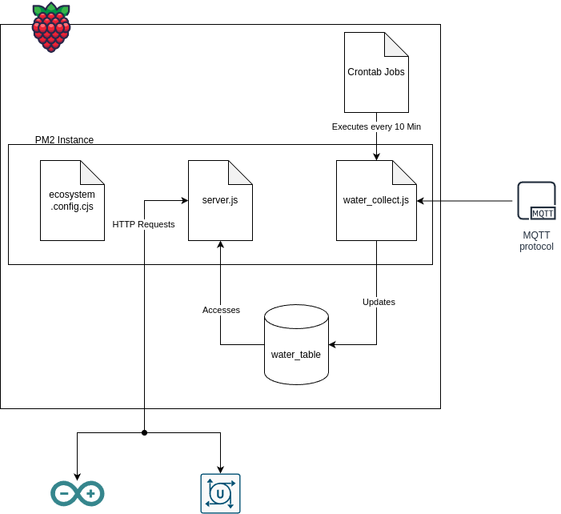

[CasaMigos](#https://casa0019-group 5.github.io/)

# CasaMigos

## Why did we choose water data?

After we received the initial brief and theme, we started digging for interesting datasets linked to UCL. We then discovered some interesting operational building data about One Pool Street. It was a live MQTT stream of water meter data in One Pool Street since the building first opened. The topic is, UCL/OPSEBOAS/PSW TW20-XX-CE-001/BACnet Interface/Application/Energy Monitoring/Water Meters, for anyone interested in exploring this data themselves! The Water Meter data was only for one tower of One Pool Street and it was split into two sections of the one tower, SAC1 and SAC2. In addition, it showed us data from Floors 4 to 19. Therefore, with SAC1 and SAC2 combined we had 30 individual water meter readings.

## Initial Brainstorm

We then had to decide how we wanted to represent this data. After some brainstorming we were all in agreement that an old-fashioned water gauge was out of the picture, we wanted something a little more unique. Taking inspiration from one of Andy's projects where he had used a syringe to visualise, we took his model of the syringe and repurposed it to show the water usage data, through the syringe pushing water up the device to demonstrate the total daily water usage.

<video width="400" controls autoplay>
    <source src="./docs/physical_device_overview.MOV" type="video/mp4">
</video>

## MQTT to Raspberry Pi

One of the main problems we encountered with the MQTT stream was the lack of control we had over the data we received. We could only display data as it came from MQTT. This meant for example we couldn't display specific data such as data from the last 24 hours. After some discussion, we decided that some sort of database was needed for the MQTT stream so we could extract specific information from it. Vineeth diligently worked away at moving the MQTT stream onto an SQL database via Raspberry Pi. After overcoming various challenges Vineeth made us a database with 4 different endpoints:

1. Latest Total Usage by Floor
   Input: FloorNum
   Output: Sum of SAC1 and SAC2 for FloorNum
2. Latest Total Uage by SAC
   Input: SACNum
   Output: Sum of all Floors for SAC#
3. Today's Usage by Floor
   Input: FloorNum
   Output: Difference between midnight and latest reading of endpoint 1
4. Today's Usage by SAC
   Input: SACNum
   Output: Difference between midnight and latest reading of endpoint 2.

## Backend Setup

To improve the run-time of the various systems of this project, as well as make better sense of the data, we've implemented a backend to suppliment the outputs. Since the water data pulled from the OPS MQTT Stream only tells us the total water used by each sensor since the time they were initialized, the `collect_water.js` script takes timestamped readings from the OPS MQTT stream, and saves them to a MariaDB table. By doing this, we now have historical data to understand how water usage changes throughout the day.

The `collect_water.js` script is setup in a PM2 instance, this contains the entire build environment, and therefore allows us to set the environmental variables. This specific script is then restarted every 10 minutes using a crontab job. Furthermore, by using a PM2 instance, we can also provide out `server.js` file with all the appropriate values to be continously running in the background of the pi.

## RaspberryPi Setup

### Install

1. Pull the RpiScript folder onto the raspberry pi.
   It should include:

- `ecosystem.config.cjs` : Contains all the environmental variables to create and run the PM2 Instance. (create your own)
- `collect_water.js` : Script to update the database.
- `server.js` : Script that contains the API.

2. Run `npm init && npm install` to install all the required node packages listed in `package.json`.

3. Install mariadb-server using `apt install mariadb-server`

- Might have to reboot

4. Start up the mariaDB Server using `sudo systemctl start mariadb`

- Verify it's running with `sudo systemctl status mariadb`

- `CTRL-C` exits the status, without stopping the service.

5. Setup the password for mariaDB

- `sudo mariadb`
- `ALTER USER 'root'@'localhost' IDENTIFIED BY '<insert password here>`;
- `FLUSH PRIVILEGES;`
- `exit`

6. Check if you can login

- `mariadb -u root -p`
- enter selected password
- Note: password should match what is listed in the .env file

7. Run `collect_water.js`

- Note: Database is built the first run, but is unaccessible by the script until the second run.

### Check Results

1. Login to MariaDB

- `mariadb -u root -p`
- Enter Password
- `SELECT water_db;`
- `SELECT * FROM water_table;`
